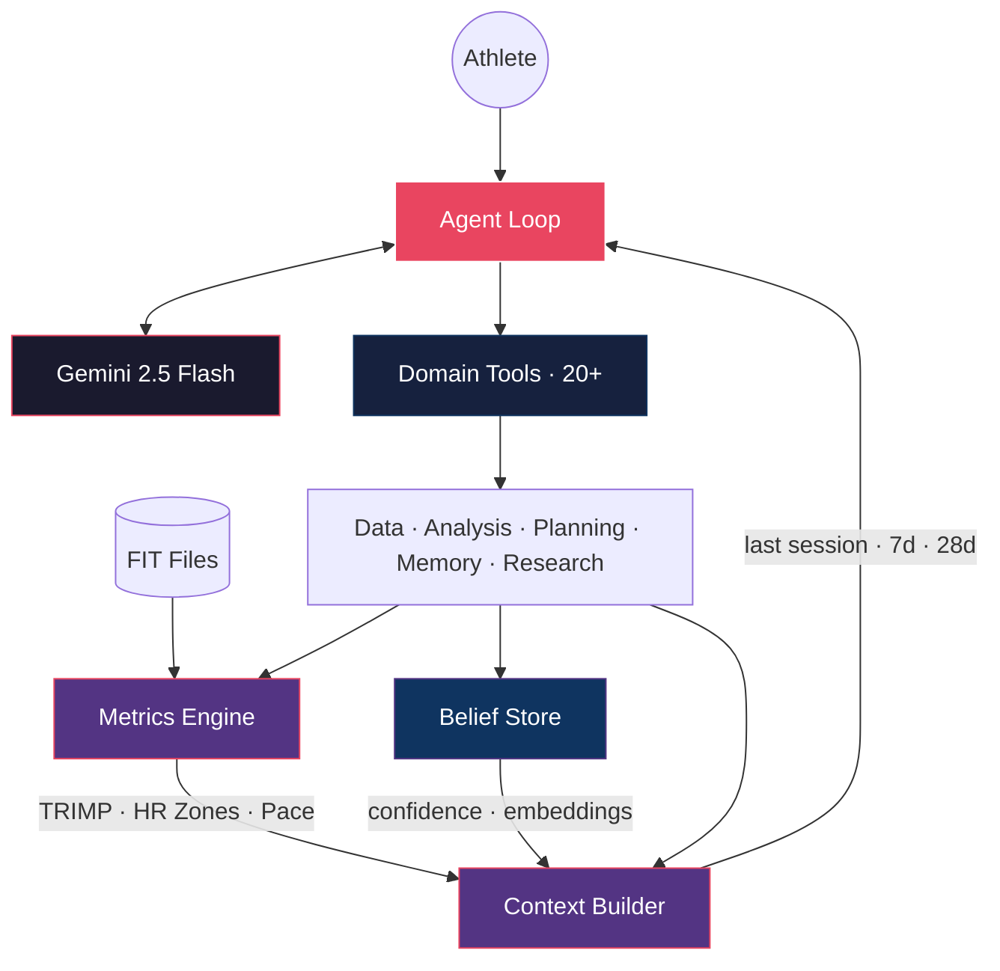
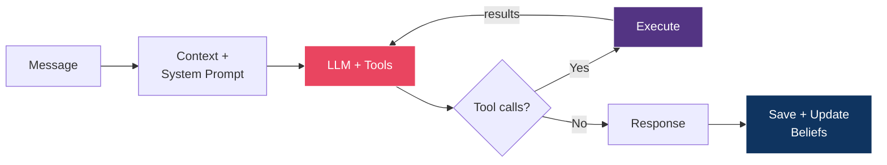
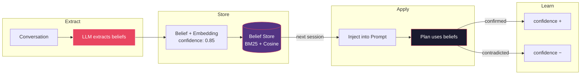
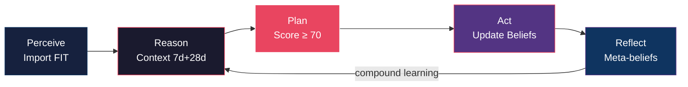

<div align="center">
  <h1>AgenticSports</h1>
  <h3>Autonomous AI Sports Coach — Depth over Breadth</h3>
  <p>
    
    
    
    
    
  </p>
</div>

**AgenticSports** is a **Proof of Concept** and core of an MVP for an autonomous AI coaching agent. Drop your Garmin FIT files in a folder — the agent imports them, builds a belief-driven athlete model, and coaches you through natural conversation.

> **Why "Depth over Breadth"?** Most agent frameworks go wide: many platforms, many providers, generic tools. AgenticSports goes **deep**: one domain, 20+ specialized tools, belief-driven memory, probabilistic athlete modeling. The LLM makes every coaching decision — but the math is always correct.

## Key Features

- **Code Computes, LLM Reasons** — TRIMP, HR zones, pace metrics are computed in Python (LLMs hallucinate math). The LLM only interprets verified numbers.
- **Belief-Driven Memory** — Every piece of athlete knowledge has confidence scores, embeddings, and outcome tracking. Stale beliefs auto-archive.
- **Proactive Intelligence** — Detects fatigue spikes, missed sessions, approaching goals, and speaks up without being asked.
- **Plan Generation + Evaluation** — Plans are scored on 6 dimensions. Below 70/100? Auto-regenerated with feedback.
- **Zero Hardcoded Rules** — All coaching decisions are LLM-driven. No if/else coaching logic anywhere.
- **Episodic Reflection** — Training block summaries feed back into future planning. Compound learning without fine-tuning.

## Architecture



The core loop is inspired by [Claude Code](https://docs.anthropic.com/en/docs/claude-code) — the LLM sees all 20+ tools and autonomously decides what to call:

```python
while not done:
    response = LLM(system_prompt, messages, tools)
    if response.has_tool_calls:
        results = execute(response.tool_calls)
        messages.append(results)
    else:
        return response.text  # coaching answer
```

<details>
<summary><b>Core Loop Diagram</b></summary>



</details>

<details>
<summary><b>Belief Memory Lifecycle</b></summary>



Each belief carries: **confidence** (0.0–1.0), **category** (preference, constraint, fitness, ...), **stability** (stable/evolving/session), **embedding** (for semantic search), and **outcome tracking** (confirmed/contradicted count).

</details>

<details>
<summary><b>Cognitive Cycle: Perceive → Reason → Plan → Act → Reflect</b></summary>



1. **Perceive** — Auto-import FIT files (5,000+ in < 1 second via hash manifest)
2. **Reason** — Multi-horizon context (last session + 7-day + 28-day) injected every turn
3. **Plan** — Generate plans, score on 6 dimensions, regenerate if < 70/100
4. **Act** — Update beliefs, track outcomes, adjust confidence
5. **Reflect** — Block reflections extract meta-beliefs for future planning

</details>

## Depth vs. Breadth

| | AgenticSports | Generic Frameworks |
|---|---|---|
| **Tools** | 20+ domain-specific | Generic (shell, web) |
| **Memory** | Beliefs + embeddings + confidence | Markdown files |
| **Math** | Python-computed, correct | LLM-computed, approximate |
| **Strength** | Deep domain reasoning | Broad platform coverage |

## Quick Start

> **Prerequisites**: Python 3.12+, [uv](https://docs.astral.sh/uv/), a [Gemini API key](https://aistudio.google.com/apikey)

```bash
git clone https://github.com/RomanRnlt/AgenticSports.git
cd AgenticSports
uv sync
echo "GEMINI_API_KEY=your-key-here" > .env
mkdir -p data/gfit    # copy your .fit files here
./start.sh
```

| Command | Description |
|---------|-------------|
| `./start.sh` | Interactive coaching chat |
| `./start.sh --assess` | Training assessment |
| `./start.sh --trajectory` | Goal trajectory prediction |
| `./start.sh --reset` | Fresh start (reset model) |

## Tech Stack

| Component | Technology |
|---|---|
| LLM | Google Gemini 2.5 Flash |
| Language | Python 3.12+ |
| CLI | Rich |
| Data | Garmin FIT via `fitdecode` |
| Search | BM25 + cosine similarity |
| Embeddings | Gemini `text-embedding-004` |
| Storage | JSON / JSONL (file-based) |

## Project Structure

```
src/
├── interface/            # Rich CLI, onboarding, chat loop
├── agent/                # Cognitive engine (~4,200 LOC)
│   ├── agent_loop.py     #   Core agentic loop
│   ├── system_prompt.py  #   Dynamic prompt builder
│   ├── proactive.py      #   Trigger engine
│   ├── reflection.py     #   Episodic reflections
│   ├── trajectory.py     #   Goal prediction
│   ├── plan_evaluator.py #   Plan quality scoring
│   └── tools/            #   20+ domain tools
├── memory/               # Belief model + episodes (~800 LOC)
└── tools/                # FIT parser + metrics (~850 LOC)
```

## Testing

```bash
uv run pytest tests/                  # unit tests
uv run pytest tests/ -m integration   # requires GEMINI_API_KEY
```

8/8 acceptance criteria passed across 3 athlete scenarios (triathlete, marathon runner, cyclist).

<details>
<summary><b>Acceptance Criteria</b></summary>

| # | Criterion | Status |
|---|-----------|--------|
| 1 | Zero hardcoded coaching rules | Passed |
| 2 | Full tool autonomy (LLM selects tools) | Passed |
| 3 | Belief persistence across sessions | Passed |
| 4 | Plan generation with quality evaluation | Passed |
| 5 | Data-driven insights from FIT files | Passed |
| 6 | Proactive communication | Passed |
| 7 | Episodic memory integration | Passed |
| 8 | Goal trajectory confidence calibration | Passed |

</details>

## Design Decisions

| Decision | Rationale |
|---|---|
| **Code computes, LLM reasons** | LLMs hallucinate numbers. `math.exp()` is always correct. |
| **Single agent, not a swarm** | One coach who knows you well > five generic assistants. |
| **20+ tools, no router** | LLM autonomously selects the right tools each turn. |
| **Belief-driven memory** | Confidence decays on contradiction, strengthens on confirmation. |
| **File-based storage** | JSON is auditable, portable, no DB dependency. |

## License

MIT — see [LICENSE](LICENSE).
