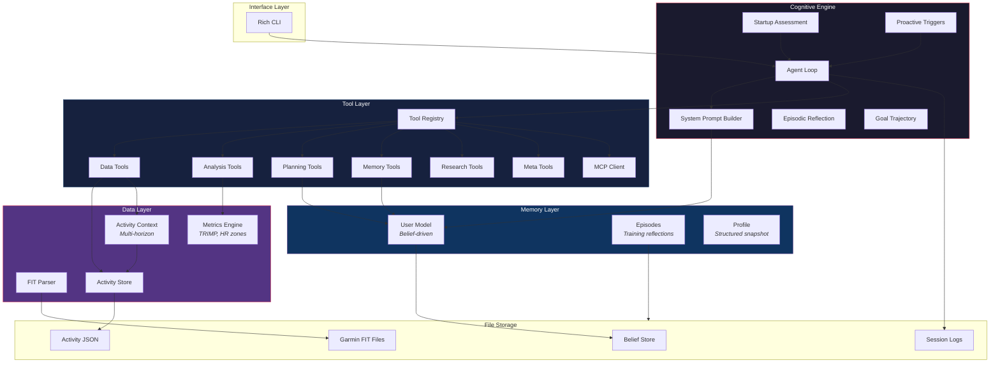
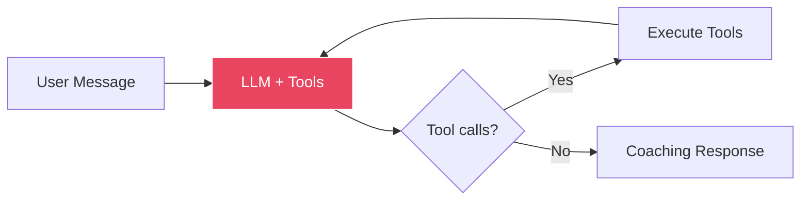

# AgenticSports — Autonomous AI Sports Coach

An autonomous AI coaching agent that converses with athletes about their actual training data. No hardcoded rules, no pre-built formulas — every coaching decision flows through an LLM-driven cognitive loop.

Built as a research project to explore how far agentic AI patterns can carry domain-specific reasoning when grounded in real data.

## What It Does

Drop your Garmin FIT files into a folder. AgenticSports autonomously imports them, builds a belief-driven athlete model, and coaches you through natural conversation:

```
You:              How was my training this week?
AgenticSports:    You logged 4 sessions (3x running, 1x cycling) totaling 6h12min.
                  Your easy runs were slightly too fast — avg HR 156 vs your Zone 2
                  ceiling of 148. Consider slowing your Tuesday recovery runs by
                  ~20 sec/km. Your Sunday long run progression looks solid.

You:              Create a plan for next week
AgenticSports:    [calls get_activities -> analyze_training_load -> generate_plan]
                  Based on your 28-day load trend and the fatigue spike from Thursday's
                  intervals, here's an adjusted week with a recovery emphasis...
```

The agent decides **what tools to call, when, and how to interpret the results** — just like a real coach who checks your training log before giving advice.

## Architecture



### The Core Loop

Inspired by [Claude Code](https://docs.anthropic.com/en/docs/claude-code)'s architecture — a simple loop that gives the LLM full autonomy over tool selection:



```python
while not done:
    response = LLM(system_prompt, messages, tools)
    if response.has_tool_calls:
        results = execute(response.tool_calls)
        messages.append(results)
    else:
        return response.text  # coaching answer
```

The model sees **all 20+ tools** and autonomously decides the right sequence. For a simple question it might call nothing. For plan generation it might chain `get_activities -> analyze_training_load -> generate_plan -> evaluate_plan` across multiple rounds.

### Key Design Decisions

| Decision | Why |
|---|---|
| **Zero hardcoded coaching rules** | Validates that LLM reasoning + data tools can replace formula-based coaching |
| **Belief-driven user model** | Each belief has confidence, category, temporal metadata, and embeddings for similarity search |
| **Multi-horizon context injection** | Every turn gets last session + 7-day + 28-day summaries — the agent always knows "where the athlete is" |
| **Episodic reflections** | Training block summaries feed back into future planning — compound learning without fine-tuning |
| **Session persistence** | JSONL turn logs enable session resumption and context compression when the window fills up |
| **Tool-free fallback** | If the LLM returns empty responses (Gemini edge case), gracefully degrades to direct conversation |

## Tech Stack

| Component | Technology |
|---|---|
| LLM | Google Gemini 2.5 Flash |
| Language | Python 3.12+ |
| CLI | Rich |
| Data | Garmin FIT files via `fitdecode` |
| Search | BM25 (belief similarity) |
| Embeddings | Gemini `text-embedding-004` |
| Storage | File-based JSON / JSONL |
| Package Manager | uv |

## Project Structure

```
src/
├── interface/           # CLI layer (Rich terminal UI)
│   ├── cli.py           # Command router, onboarding, chat
│   └── __main__.py      # Entry point
│
├── agent/               # Cognitive engine (~4,000 LOC)
│   ├── agent_loop.py    # Core loop (LLM + tools)
│   ├── system_prompt.py # Dynamic prompt with athlete context
│   ├── startup.py       # Session greeting & assessment
│   ├── proactive.py     # Trigger engine (fatigue, milestones, risk)
│   ├── reflection.py    # Training block reflections
│   ├── trajectory.py    # Goal attainment prediction
│   ├── plan_evaluator.py# Plan quality scoring
│   ├── tools/           # Tool registry + 6 tool modules
│   │   ├── registry.py  # Unified tool interface
│   │   ├── data_tools.py
│   │   ├── analysis_tools.py
│   │   ├── planning_tools.py
│   │   ├── memory_tools.py
│   │   ├── research_tools.py
│   │   └── meta_tools.py
│   └── mcp/             # Model Context Protocol client
│
├── memory/              # Athlete knowledge
│   ├── user_model.py    # Belief-driven model with embeddings
│   ├── profile.py       # Structured profile snapshots
│   └── episodes.py      # Episodic memory
│
└── tools/               # Data parsing & metrics
    ├── fit_parser.py    # Garmin FIT -> structured data
    ├── activity_store.py# Activity persistence + auto-import
    ├── activity_context.py # Multi-horizon context builder
    ├── fitness_tracker.py
    └── metrics.py       # TRIMP, HR zones, VO2max
```

## Getting Started

### Prerequisites

- Python 3.12+
- [uv](https://docs.astral.sh/uv/) package manager
- A Gemini API key ([get one here](https://aistudio.google.com/apikey))

### Setup

```bash
git clone https://github.com/RomanRnlt/AgenticSports.git
cd AgenticSports

# Install dependencies
uv sync

# Configure API key
echo "GEMINI_API_KEY=your-key-here" > .env

# Add your Garmin FIT files
mkdir -p data/gfit
# Copy your .fit files into data/gfit/

# Run
./start.sh
```

### Usage

```bash
# Interactive chat mode (default)
./start.sh

# Run a training assessment
./start.sh --assess

# Goal trajectory prediction
./start.sh --trajectory

# Fresh start (reset user model)
./start.sh --reset
```

## How the Agent Thinks

### 1. Perceive
On startup, AgenticSports auto-imports any new FIT files using a two-pass strategy: fast classification (sport detection from session frames), then targeted parsing of new files. 5,000+ files import in under a second on subsequent launches.

### 2. Reason
The system prompt injects multi-horizon context (last session, 7-day trend, 28-day load) so the LLM always has situational awareness. Proactive triggers detect patterns like rising fatigue, missed sessions, or approaching goals.

### 3. Plan
Training plans are generated through a tool chain: the agent queries activity history, assesses current fitness, then generates a plan. A separate evaluation step scores plans on specificity, completeness, and alignment with athlete data.

### 4. Act
The belief-driven user model captures everything the agent learns — preferences, constraints, fitness level, injury history — as structured beliefs with confidence scores and embeddings. This knowledge persists across sessions.

### 5. Reflect
After training blocks, the agent generates episodic reflections: what worked, what didn't, fitness deltas. These reflections feed back into future planning — compound learning without model fine-tuning.

## Testing

```bash
# Unit tests
uv run pytest tests/

# Integration tests (requires GEMINI_API_KEY)
uv run pytest tests/ -m integration
```

The test suite includes 3 athlete scenarios (triathlete, marathon runner, cyclist) validated against 8 acceptance criteria covering plan quality, belief extraction, and coaching behavior.

## License

This project is licensed under the MIT License — see the [LICENSE](LICENSE) file for details.
