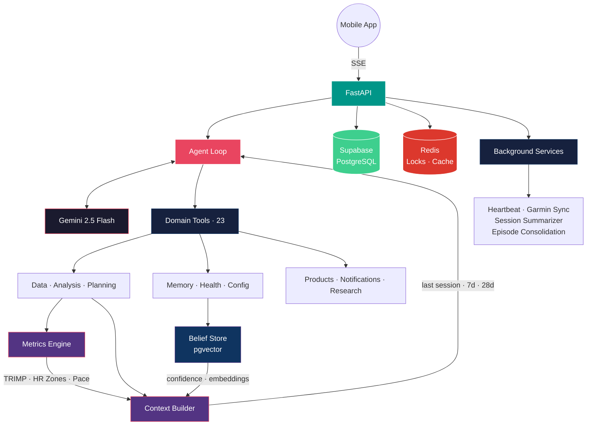
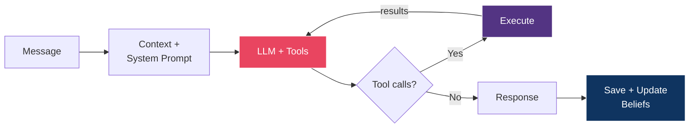
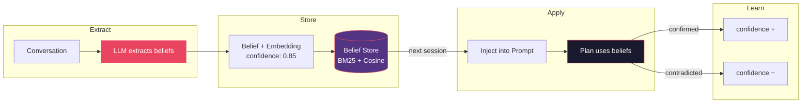
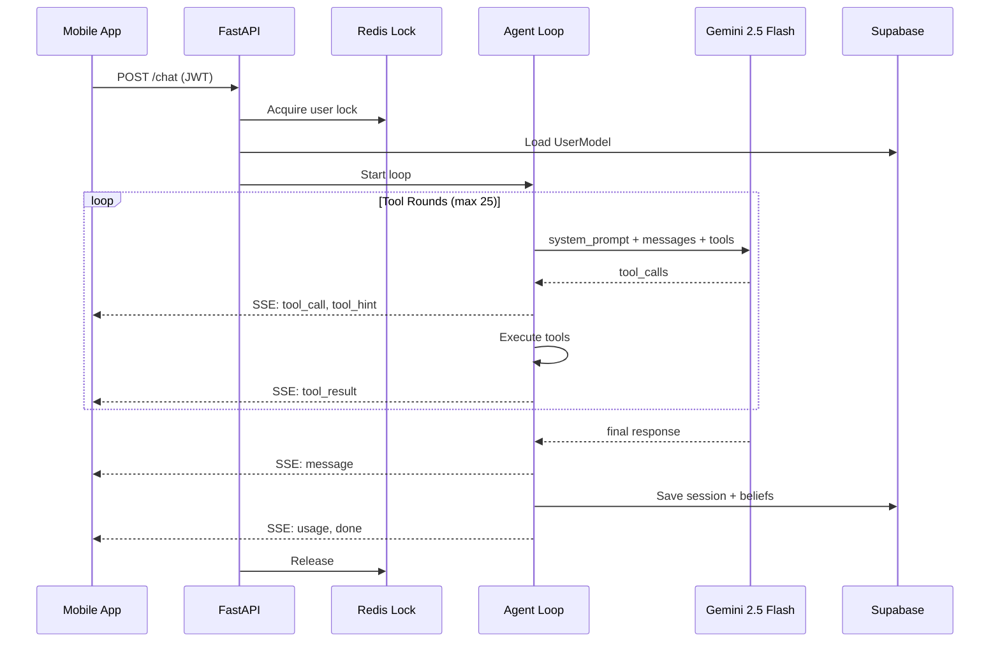
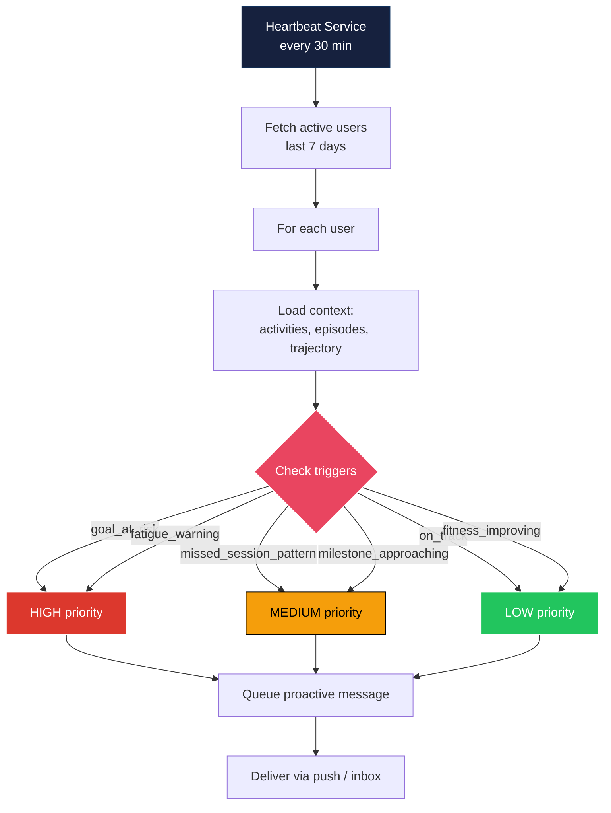

<div align="center">
  <h1>Athletly Backend</h1>
  <h3>Autonomous AI Sports Coach — Depth over Breadth</h3>
  <p>
    
    
    
    
    
    
    
  </p>
</div>

**Athletly Backend** is the autonomous AI coaching engine behind the [Athletly app](https://github.com/athletly/athletly-app). An agentic loop with 23 specialized tools, belief-driven memory, and real-time SSE streaming — deployed as a FastAPI service with Supabase multi-user persistence and Redis concurrency control.

> **Why "Depth over Breadth"?** Most agent frameworks go wide: many platforms, many providers, generic tools. Athletly goes **deep**: one domain, 23 specialized tools, belief-driven memory, probabilistic athlete modeling. The LLM makes every coaching decision — but the math is always correct.

## Key Features

- **Code Computes, LLM Reasons** — TRIMP, HR zones, pace metrics computed in Python. The LLM only interprets verified numbers.
- **Belief-Driven Memory** — Every piece of athlete knowledge has confidence scores, pgvector embeddings, and outcome tracking. Stale beliefs auto-archive.
- **Multi-User Isolation** — Supabase RLS + Redis distributed locks. Each athlete's data is fully isolated.
- **Real-Time Streaming** — SSE-based responses with live tool call visibility (thinking, tool_call, tool_result, message events).
- **Proactive Intelligence** — Background heartbeat detects fatigue spikes, missed sessions, approaching goals, and speaks up without being asked.
- **Plan Generation + Evaluation** — Plans scored on 6 dimensions. Below 70/100? Auto-regenerated with feedback.
- **Health Integration** — Garmin Connect, Apple Health, and Google Health Connect data sync.
- **Zero Hardcoded Rules** — All coaching decisions are LLM-driven. Sport metrics, evaluation criteria, and periodization models defined at runtime by the agent.

## Architecture


```mermaid
graph TD
    A(("Mobile App")) -->|SSE| B["FastAPI"]
    B --> C["Agent Loop"]
    C <--> D["Gemini 2.5 Flash"]
    C --> E["Domain Tools · 23"]

    E --> E1["Data · Analysis · Planning"]
    E --> E2["Memory · Health · Config"]
    E --> E3["Products · Notifications · Research"]

    E1 --> F["Metrics Engine"]
    E2 --> G["Belief Store\npgvector"]
    E1 --> H["Context Builder"]

    F -->|"TRIMP · HR Zones · Pace"| H
    G -->|"confidence · embeddings"| H
    H -->|"last session · 7d · 28d"| C

    B --> I[("Supabase\nPostgreSQL")]
    B --> J[("Redis\nLocks · Cache")]
    B --> K["Background Services"]
    K --> K1["Heartbeat · Garmin Sync\nSession Summarizer\nEpisode Consolidation"]

    style B fill:#009688,stroke:#fff,color:#fff
    style C fill:#e94560,stroke:#fff,color:#fff
    style D fill:#1a1a2e,stroke:#e94560,color:#fff
    style E fill:#16213e,stroke:#0f3460,color:#fff
    style F fill:#533483,stroke:#e94560,color:#fff
    style G fill:#0f3460,stroke:#533483,color:#fff
    style H fill:#533483,stroke:#e94560,color:#fff
    style I fill:#3ECF8E,stroke:#fff,color:#fff
    style J fill:#DC382D,stroke:#fff,color:#fff
    style K fill:#16213e,stroke:#0f3460,color:#fff
```

The core loop is inspired by [Claude Code](https://docs.anthropic.com/en/docs/claude-code) — the LLM sees all 23 tools and autonomously decides what to call:

```python
while not done:
    response = LLM(system_prompt, messages, tools)
    if response.has_tool_calls:
        results = execute(response.tool_calls)
        messages.append(results)
    else:
        return response.text  # coaching answer
```

<details>
<summary><b>Core Loop Diagram</b></summary>


```mermaid
flowchart LR
    A["Message"] --> B["Context +<br/>System Prompt"]
    B --> C["LLM + Tools"]
    C --> D{Tool calls?}
    D -->|Yes| E["Execute"]
    E -->|results| C
    D -->|No| F["Response"]
    F --> G["Save + Update<br/>Beliefs"]

    style C fill:#e94560,stroke:#fff,color:#fff
    style E fill:#533483,stroke:#fff,color:#fff
    style G fill:#0f3460,stroke:#fff,color:#fff
```

</details>

<details>
<summary><b>Belief Memory Lifecycle</b></summary>


```mermaid
flowchart LR
    subgraph Extract
        A["Conversation"] --> B["LLM extracts beliefs"]
    end

    subgraph Store
        B --> C["Belief + Embedding<br/>confidence: 0.85"]
        C --> D[("Belief Store<br/>BM25 + Cosine")]
    end

    subgraph Apply
        D -->|next session| E["Inject into Prompt"]
        E --> F["Plan uses beliefs"]
    end

    subgraph Learn
        F -->|confirmed| G["confidence +"]
        F -->|contradicted| H["confidence −"]
    end

    style B fill:#e94560,stroke:#fff,color:#fff
    style D fill:#533483,stroke:#e94560,color:#fff
    style F fill:#1a1a2e,stroke:#e94560,color:#fff
```

Each belief carries: **confidence** (0.0–1.0), **category** (preference, constraint, fitness, ...), **stability** (stable/evolving/session), **embedding** (768-dim, Gemini text-embedding-004), and **outcome tracking** (confirmed/contradicted count).

</details>

<details>
<summary><b>SSE Streaming Flow</b></summary>


```mermaid
sequenceDiagram
    participant App as Mobile App
    participant API as FastAPI
    participant Lock as Redis Lock
    participant Agent as Agent Loop
    participant LLM as Gemini 2.5 Flash
    participant DB as Supabase

    App->>API: POST /chat (JWT)
    API->>Lock: Acquire user lock
    API->>DB: Load UserModel
    API->>Agent: Start loop

    loop Tool Rounds (max 25)
        Agent->>LLM: system_prompt + messages + tools
        LLM-->>Agent: tool_calls
        Agent-->>App: SSE: tool_call, tool_hint
        Agent->>Agent: Execute tools
        Agent-->>App: SSE: tool_result
    end

    LLM-->>Agent: final response
    Agent-->>App: SSE: message
    Agent->>DB: Save session + beliefs
    Agent-->>App: SSE: usage, done
    API->>Lock: Release
```

</details>

<details>
<summary><b>Proactive Intelligence</b></summary>


```mermaid
flowchart TD
    A["Heartbeat Service<br/>every 30 min"] --> B["Fetch active users<br/>last 7 days"]
    B --> C["For each user"]
    C --> D["Load context:<br/>activities, episodes, trajectory"]
    D --> E{"Check triggers"}

    E -->|goal_at_risk| F["HIGH priority"]
    E -->|fatigue_warning| F
    E -->|missed_session_pattern| G["MEDIUM priority"]
    E -->|milestone_approaching| G
    E -->|on_track| H["LOW priority"]
    E -->|fitness_improving| H

    F --> I["Queue proactive message"]
    G --> I
    H --> I
    I --> J["Deliver via push / inbox"]

    style A fill:#16213e,stroke:#0f3460,color:#fff
    style E fill:#e94560,stroke:#fff,color:#fff
    style F fill:#DC382D,stroke:#fff,color:#fff
    style G fill:#F59E0B,stroke:#000,color:#000
    style H fill:#22C55E,stroke:#fff,color:#fff
```

</details>

## API Endpoints

### Chat (Real-Time Coaching)

| Method | Endpoint | Description |
|---|---|---|
| `POST` | `/chat` | Stream agent response via SSE. Body: `{ message, session_id?, context? }` |
| `POST` | `/chat/confirm` | User confirmation for checkpoint proposals. Body: `{ session_id, action_id, confirmed }` |

**SSE Events**: `session_start` → `thinking` → `tool_call` → `tool_hint` → `tool_result` → `message` → `usage` → `done`

### Garmin Integration

| Method | Endpoint | Description |
|---|---|---|
| `POST` | `/garmin/connect` | Authenticate with Garmin credentials |
| `GET` | `/garmin/status` | Check connection status |
| `POST` | `/garmin/sync` | Trigger manual sync (15-min cooldown) |
| `DELETE` | `/garmin/disconnect` | Remove Garmin tokens |

### Webhook & Health

| Method | Endpoint | Description |
|---|---|---|
| `POST` | `/webhook/activity` | Receive activity events (HMAC-SHA256 validated) |
| `GET` | `/health` | Health check (`{ status: "ok", version }`) |

All endpoints require Supabase JWT authentication (except `/health`).

## Agent Tools (23 Modules)

| Category | Tools | Purpose |
|---|---|---|
| **Data** | `get_athlete_profile`, `get_activities`, `get_current_plan`, `get_past_plans`, `get_beliefs` | Read athlete state |
| **Analysis** | `analyze_training_load`, `compare_plan_vs_actual`, `classify_activity` | Training insights |
| **Planning** | `create_training_plan`, `evaluate_plan`, `save_plan`, `adjust_plan` | Plan lifecycle |
| **Health** | `get_health_data`, `get_daily_metrics`, `analyze_health_trends`, `get_health_inventory` | Health integration |
| **Memory** | `add_belief`, `update_profile`, `get_beliefs`, `get_episodes` | Belief management |
| **Config** | `define_metric`, `define_eval_criteria`, `define_session_schema`, `define_periodization`, `define_trigger_rule` | Runtime definitions |
| **Goals** | `assess_goal_trajectory` | Finish time prediction |
| **Macrocycle** | `get_macrocycle`, `create_macrocycle`, `update_macrocycle_progress` | Periodization |
| **Products** | `recommend_products` | Affiliate recommendations |
| **Checkpoints** | `propose_plan_change`, `get_pending_confirmations` | Async user confirmation |
| **Notifications** | `send_notification` | Inbox, SMS, email |
| **Research** | `web_search` | Brave Search API |
| **Calculation** | `calculate_metric`, `calculate_bulk_metrics` | Dynamic formula evaluation |
| **Garmin** | `sync_garmin_data` | Manual Garmin sync |
| **Meta** | `list_tools`, `get_model_info` | Agent introspection |

## Database (Supabase / PostgreSQL)

### Core Tables

| Table | Purpose |
|---|---|
| `profiles` | Structured athlete model (sports, goals, fitness, constraints) |
| `beliefs` | Belief system with pgvector embeddings (768-dim), confidence, categories |
| `activities` | Parsed fitness activities (manual, Garmin, webhook sources) |
| `sessions` | Chat session lifecycle with compressed summaries |
| `session_messages` | Per-session message history (user, model, tool_call, system roles) |
| `episodes` | Episodic memory (weekly reflections, milestones, meta-beliefs) |
| `plans` | Training plans with evaluation scores |

### Extended Tables

| Table | Purpose |
|---|---|
| `health_activities` | Garmin/Apple Health synced activities |
| `health_daily_metrics` | Daily summaries (sleep, HRV, stress, body battery, recovery) |
| `agent_config` | Runtime-defined metrics, eval criteria, periodization models |
| `proactive_messages` | Background trigger message queue |
| `pending_actions` | Checkpoint flow (awaiting user confirmation) |
| `goal_trajectory` | Goal prediction snapshots |
| `provider_tokens` | OAuth tokens (Garmin) |
| `product_recommendations` | Product search cache |

All tables use Row-Level Security (RLS). Each user can only access their own data.

## Background Services

| Service | Interval | Purpose |
|---|---|---|
| **HeartbeatService** | 30 min | Proactive trigger detection for active users |
| **GarminSyncService** | On demand | Activity + daily metrics sync (15-min cooldown) |
| **SessionSummarizerService** | Per session | Compress previous session for context efficiency |
| **EpisodeConsolidationService** | Post-reflection | Multi-episode meta-learning |
| **ConfigGCService** | Post-onboarding | Garbage collection for stale agent configs |
| **UsageTrackerService** | Per request | Token budget enforcement (500K/user/day) |

## Project Structure

```
src/
├── api/                          # FastAPI application
│   ├── main.py                  #   App factory, CORS, rate limiting, lifespan
│   ├── auth.py                  #   Supabase JWT authentication
│   ├── rate_limiter.py          #   slowapi rate limiting
│   ├── sse.py                   #   Server-Sent Events helpers
│   └── routers/
│       ├── chat.py              #   POST /chat (SSE), POST /chat/confirm
│       ├── webhook.py           #   POST /webhook/activity (HMAC validation)
│       └── garmin.py            #   Garmin Connect OAuth endpoints
│
├── agent/                        # Cognitive engine (~4,200 LOC)
│   ├── agent_loop.py            #   Core agentic loop
│   ├── system_prompt.py         #   Dynamic context builder
│   ├── proactive.py             #   Trigger detection engine
│   ├── reflection.py            #   Episodic reflections & meta-beliefs
│   ├── trajectory.py            #   Goal trajectory prediction
│   ├── plan_evaluator.py        #   Plan quality scoring (6 dimensions)
│   ├── planner.py               #   Training plan generation
│   ├── assessment.py            #   Initial fitness assessment
│   ├── startup.py               #   Goal type inference & greeting
│   ├── coach.py                 #   High-level coaching wrapper
│   ├── llm.py                   #   LiteLLM wrapper (Gemini/Claude/OpenAI fallback)
│   └── tools/                   #   23 tool modules
│       ├── registry.py          #     Tool registration & execution
│       ├── data_tools.py        #     Athlete profile, activities, plans
│       ├── analysis_tools.py    #     Training load, plan adherence
│       ├── planning_tools.py    #     Plan creation, evaluation, saving
│       ├── memory_tools.py      #     Beliefs, profile updates
│       ├── config_tools.py      #     Runtime metric/criteria definitions
│       ├── health_tools.py      #     Health data, daily metrics
│       ├── health_trend_tools.py #    Recovery patterns, HRV trends
│       ├── research_tools.py    #     Web search (Brave API)
│       ├── calc_tools.py        #     Dynamic formula evaluation
│       ├── goal_trajectory_tools.py # Goal prediction
│       ├── macrocycle_tools.py  #     Training cycles, periodization
│       ├── product_tools.py     #     Affiliate product recommendations
│       ├── checkpoint_tools.py  #     Async user confirmations
│       ├── notification_tools.py #    Inbox, SMS, email delivery
│       └── ...                  #     garmin, onboarding, session, meta, ...
│
├── memory/                       # Belief model + episodic memory (~800 LOC)
│   ├── user_model.py            #   UserModel (structured core + beliefs)
│   ├── profile.py               #   Profile projection from UserModel
│   └── episodes.py              #   Episode storage and retrieval
│
├── db/                           # Supabase/PostgreSQL persistence (19 modules)
│   ├── client.py                #   Supabase client singleton
│   ├── user_model_db.py         #   Profiles + beliefs (pgvector)
│   ├── activity_store_db.py     #   Activities + import manifest
│   ├── session_store_db.py      #   Sessions + message history
│   ├── episodes_db.py           #   Episode CRUD
│   ├── plans_db.py              #   Training plans + evaluation
│   ├── health_data_db.py        #   Garmin/Apple Health data
│   ├── agent_config_db.py       #   Runtime config definitions
│   ├── proactive_queue_db.py    #   Proactive message queue
│   ├── pending_actions_db.py    #   Checkpoint actions
│   ├── goal_trajectory_db.py    #   Goal trajectory snapshots
│   ├── provider_tokens_db.py    #   OAuth tokens
│   └── ...                      #   health_inventory, macrocycle, products
│
├── services/                     # Background workers & integrations
│   ├── heartbeat.py             #   30-min proactive trigger loop
│   ├── garmin_sync.py           #   Garmin Connect OAuth + activity sync
│   ├── session_summarizer.py    #   Async session compression
│   ├── episode_consolidation.py #   Multi-episode meta-learning
│   ├── config_gc.py             #   Stale config garbage collection
│   ├── health_context.py        #   Health metric context builder
│   ├── product_search.py        #   Amazon PA-API + Awin affiliate search
│   ├── affiliate_provider.py    #   Affiliate link generation
│   └── usage_tracker.py         #   Token budget enforcement
│
├── calc/
│   └── engine.py                #   Expression evaluation for dynamic metrics
│
├── tools/                        # Legacy fitness metrics (gradual migration)
│   ├── fit_parser.py            #   Garmin FIT file parsing
│   ├── fitness_tracker.py       #   TRIMP, pace, HR zones
│   └── metrics.py               #   Power/pace/HR calculations
│
└── config.py                     # Pydantic Settings v2 (env validation)
```

## Tech Stack

| Component | Technology |
|---|---|
| API | FastAPI + Uvicorn |
| LLM | Google Gemini 2.5 Flash (LiteLLM, Claude/OpenAI fallback) |
| Database | Supabase (PostgreSQL + pgvector + RLS) |
| Concurrency | Redis (distributed locks, caching, cooldowns) |
| Embeddings | Gemini `text-embedding-004` (768-dim) |
| Streaming | Server-Sent Events (SSE) |
| Auth | Supabase JWT (ES256) |
| Health Data | Garmin Connect (Garth), Apple Health, Google Health Connect |
| Products | Amazon PA-API v5, Awin affiliate network |
| Search | Brave Search API |
| Language | Python 3.12+ |
| Package Manager | uv |

## Quick Start

> **Prerequisites**: Python 3.12+, [uv](https://docs.astral.sh/uv/), a [Gemini API key](https://aistudio.google.com/apikey), Supabase project, Redis

```bash
git clone https://github.com/athletly/athletly-backend.git
cd athletly-backend
uv sync
cp .env.example .env   # fill in required keys (see below)
uvicorn src.api.main:app --reload
```

### Environment Variables

| Variable | Required | Description |
|---|---|---|
| `GEMINI_API_KEY` | Yes | Google Gemini API key |
| `SUPABASE_URL` | Yes | Supabase project URL |
| `SUPABASE_ANON_KEY` | Yes | Supabase anonymous key |
| `SUPABASE_SERVICE_ROLE_KEY` | Yes | Supabase service role key |
| `SUPABASE_JWT_SECRET` | Yes | JWT verification secret |
| `REDIS_URL` | No | Redis URL (default: `localhost:6379`) |
| `WEBHOOK_SECRET` | No | HMAC secret for activity webhooks |
| `BRAVE_API_KEY` | No | Brave Search API key |
| `AMAZON_AFFILIATE_TAG` | No | Amazon affiliate tag |
| `AMAZON_PA_API_ACCESS_KEY` | No | Amazon Product Advertising API key |
| `AWIN_AFFILIATE_ID` | No | Awin affiliate network ID |

### CLI Mode (Development)

```bash
./start.sh                  # Interactive coaching chat
./start.sh --assess         # Training assessment
./start.sh --trajectory     # Goal trajectory prediction
```

## Testing

```bash
uv run pytest tests/                  # unit tests
uv run pytest tests/ -m integration   # requires API keys
```

8/8 acceptance criteria passed across 3 athlete scenarios (triathlete, marathon runner, cyclist).

<details>
<summary><b>Acceptance Criteria</b></summary>

| # | Criterion | Status |
|---|-----------|--------|
| 1 | Zero hardcoded coaching rules | Passed |
| 2 | Full tool autonomy (LLM selects tools) | Passed |
| 3 | Belief persistence across sessions | Passed |
| 4 | Plan generation with quality evaluation | Passed |
| 5 | Data-driven insights from health data | Passed |
| 6 | Proactive communication | Passed |
| 7 | Episodic memory integration | Passed |
| 8 | Goal trajectory confidence calibration | Passed |

</details>

## Design Decisions

| Decision | Rationale |
|---|---|
| **Code computes, LLM reasons** | LLMs hallucinate numbers. `math.exp()` is always correct. |
| **Single agent, not a swarm** | One coach who knows you well > five generic assistants. |
| **23 tools, no router** | LLM autonomously selects the right tools each turn. |
| **Belief-driven memory** | Confidence decays on contradiction, strengthens on confirmation. |
| **Supabase + RLS** | Multi-user isolation at database layer; service role for backend ops. |
| **Redis distributed locks** | Prevent concurrent requests per user; graceful in-process fallback. |
| **SSE streaming** | Real-time tool calls visible to client; natural conversational flow. |
| **Runtime config definitions** | Zero hardcoded sport knowledge; agent defines all metrics/criteria. |

## Depth vs. Breadth

| | Athletly | Generic Frameworks |
|---|---|---|
| **Tools** | 23 domain-specific | Generic (shell, web) |
| **Memory** | Beliefs + pgvector + confidence | Markdown files |
| **Math** | Python-computed, correct | LLM-computed, approximate |
| **Persistence** | Supabase + RLS multi-user | File-based, single-user |
| **Streaming** | SSE with tool visibility | Request-response |
| **Strength** | Deep domain reasoning | Broad platform coverage |

## License

MIT — see [LICENSE](LICENSE).
